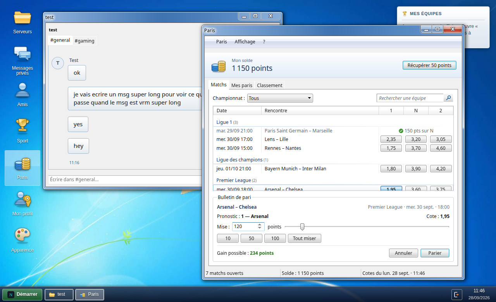
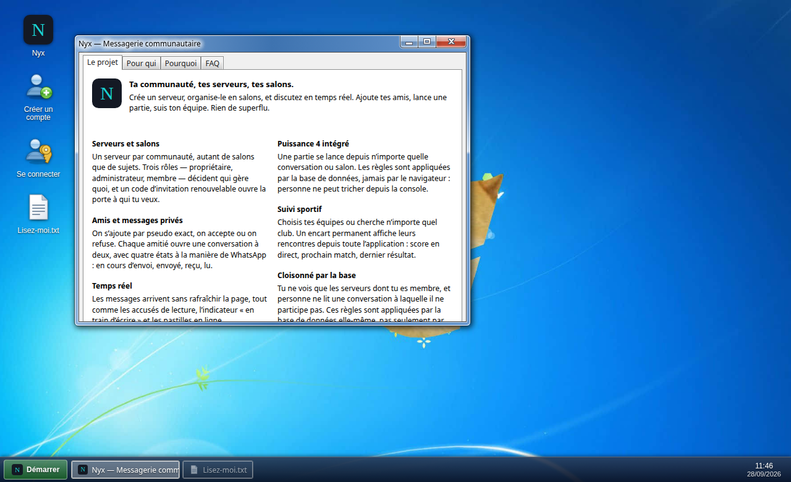
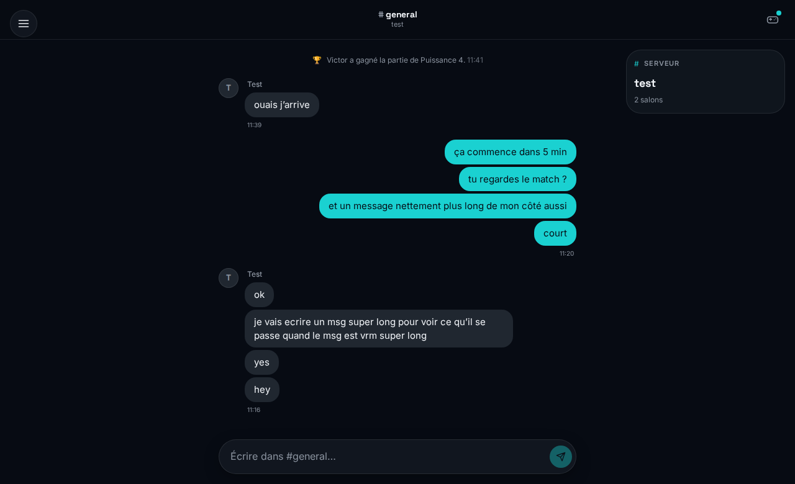

<div align="center">


# Nyx

**Messagerie communautaire : serveurs, salons, amis, mini-jeu et paris sportifs en points.**

Projet fil rouge du module 8WEB101 — écrit en HTML, CSS et JavaScript, sans framework ni étape de construction.


</div>



## Sommaire

- [Présentation](#présentation)
- [Fonctionnalités](#fonctionnalités)
- [Aperçu](#aperçu)
- [Technologies](#technologies)
- [Installation](#installation)
- [Structure du dépôt](#structure-du-dépôt)
- [Sécurité et données](#sécurité-et-données)
- [Limites connues](#limites-connues)
- [Documentation](#documentation)
- [Crédits](#crédits)
- [Auteurs](#auteurs)

## Présentation

Nyx s'organise comme Discord : chacun crée ses **serveurs**, les découpe en
**salons** et y invite qui il veut. À côté, les **amis** et les **messages
privés** fonctionnent comme une messagerie classique, avec accusés de lecture.

Deux ajouts le distinguent : un **Puissance 4** jouable depuis n'importe quelle
conversation, et un **suivi sportif** où l'on suit ses équipes et où l'on parie
des **points gratuits** sur les prochains matchs, à de vraies cotes.

Tout le site tient en fichiers statiques : il n'y a rien à compiler ni à
installer, pas de `node_modules`. Les données, l'authentification et le temps
réel reposent sur [Supabase](https://supabase.com).

## Fonctionnalités

- **Serveurs et salons** — trois rôles (propriétaire, administrateur, membre),
  codes d'invitation renouvelables, salons par sujet.
- **Amis et messages privés** — ajout par pseudo, demandes à accepter ou
  refuser, conversations à deux.
- **Temps réel** — messages sans rechargement, indicateur « en train
  d'écrire », présence en ligne, accusés envoyé / reçu / lu.
- **Profil** — photo, nom affiché, présentation.
- **Puissance 4** — une partie se lance depuis un salon ou une conversation ;
  les règles sont vérifiées par la base de données, pas par le navigateur.
- **Suivi sportif** — recherche de n'importe quel club, logos, et un encart qui
  affiche les rencontres de ses équipes depuis toute l'application.
- **Paris en points** — cotes réelles des bookmakers européens, bonus
  quotidien, historique de ses paris et classement général.
- **Cinq thèmes** — Sombre, Clair, Contraste élevé, Terminal et Windows 7.
  Ce dernier transforme la messagerie en **bureau** : un dossier de serveurs,
  une fenêtre par serveur et un onglet par salon.
- **Adapté au téléphone** — chaque écran fonctionne dès 390 px de large.

## Aperçu

| Page d'accueil | Messagerie (thème sombre) |
| --- | --- |
|  |  |

*Captures réalisées avec des données fictives.*

## Technologies

| Rôle | Choix |
| --- | --- |
| Interface | HTML, CSS, JavaScript (modules ES), sans framework |
| Style Windows 7 | [7.css](https://khang-nd.github.io/7.css/) et [WebWin7](https://github.com/goph-R/WebWin7) |
| Base de données, comptes, temps réel, fichiers | [Supabase](https://supabase.com) (PostgreSQL) |
| Scores et logos des clubs | [TheSportsDB](https://www.thesportsdb.com) |
| Cotes et résultats des paris | [The Odds API](https://the-odds-api.com), interrogée par la base avec `pg_net` et `pg_cron` |

La bibliothèque Supabase et les polices sont incluses dans le dépôt : aucun
CDN, et aucune adresse IP de visiteur n'est transmise à un tiers pour les
charger.

## Installation

### Prérequis

- un projet [Supabase](https://supabase.com) (l'offre gratuite suffit) ;
- Python 3, ou n'importe quel serveur de fichiers statiques ;
- pour les paris uniquement : un compte gratuit [The Odds API](https://the-odds-api.com).

### 1. Récupérer le code

```bash
git clone https://github.com/ZraXtv/8WEB101_-_Nyx.git
cd 8WEB101_-_Nyx
```

### 2. Préparer la base de données

Dans le **SQL Editor** de Supabase, exécute **dans l'ordre** les fichiers du
dossier [`migration/`](migration/), de `0001_init.sql` à
`0012_sport_fournisseur.sql`.

La treizième, `0013_paris.sql`, ajoute les paris. Elle demande d'activer deux
extensions et de ranger une clé dans le coffre de Supabase : suis le guide
[`migration/readme-migration.md`](migration/readme-migration.md). Tant qu'elle
n'est pas exécutée, les paris restent simplement cachés.

### 3. Renseigner la configuration

```bash
cp config.exemple.js config.js
```

Ouvre `config.js` et renseigne l'**URL** et la **clé publiable** de ton projet
(Supabase → *Project Settings* → *API*). Ce fichier n'est pas versionné.

> N'y mets **jamais** la clé `service_role` : elle contourne toutes les règles
> de sécurité de la base.

### 4. Lancer

Les modules JavaScript ne se chargent pas depuis un fichier ouvert en
double-cliquant (`file://`) : il faut un serveur.

```bash
python3 -m http.server 8000
```

Puis ouvre <http://localhost:8000>. L'extension *Live Server* de VS Code ou
`npx serve` font aussi l'affaire.

### Mettre en ligne

N'importe quel hébergement de fichiers statiques convient (GitHub Pages,
Netlify, un serveur Apache…). Deux points à ne pas oublier :

- le fichier `config.js` doit être présent sur l'hébergement ;
- dans Supabase → *Authentication* → *URL Configuration*, indique l'adresse du
  site, sans quoi les liens de confirmation d'e-mail mèneraient ailleurs.

## Structure du dépôt

```
├── index.html            page d'accueil (bureau Windows 7)
├── connexion.html        connexion
├── inscription.html      création de compte
├── app.html              la messagerie, disposition classique
├── app-win7.html         la messagerie, disposition bureau (thème Windows 7)
├── *-sombre.html         ancienne version sombre des trois premières pages
├── config.exemple.js     modèle de configuration, à copier en config.js
├── css/                  styles (thèmes, messagerie, bureau…)
├── js/                   modules : données, temps réel, amis, serveurs, sport, paris…
├── migration/            les migrations SQL et le guide des paris
├── docs/                 notes techniques et captures d'écran
├── img/                  icône du site et icônes du bureau
├── fonts/                polices Inter et Space Grotesk
├── win7/                 7.css, fond d'écran et licence de WebWin7
└── vendor/               bibliothèque Supabase
```

Le détail de chaque fichier est dans les [notes techniques](docs/notes-techniques.md).

## Sécurité et données

- **Les règles d'accès vivent dans la base**, sous forme de *Row Level
  Security* et de fonctions PostgreSQL : on ne voit que les serveurs dont on
  est membre et les conversations auxquelles on participe. Modifier le code de
  la page n'y change rien.
- **La clé présente dans le navigateur est la clé « publiable »** de Supabase,
  conçue pour être publique : c'est la base qui protège les données, pas le
  secret de cette clé.
- **Les paris ne se décident pas dans le navigateur.** Solde, horaire du coup
  d'envoi, cote et paiement des gains sont vérifiés par la base. La clé
  The Odds API est rangée dans le coffre de Supabase et ne quitte jamais la base.
- **Aucun argent réel.** Les points sont gratuits : ils ne s'achètent pas et ne
  se revendent pas. Pouvoir en acheter transformerait ces paris en jeux
  d'argent, interdits sans agrément de l'ANJ.
- **Mots de passe** : au moins 12 caractères, et trois types de caractères
  parmi minuscules, majuscules, chiffres et caractères spéciaux.

## Limites connues

- **Pas de suppression de compte** depuis l'application pour l'instant.
- **Les paris sont réglés deux fois par jour**, et non en direct : c'est le prix
  de l'offre gratuite de The Odds API (500 crédits par mois).
- **Sur le bureau Windows 7, une seule conversation reçoit les messages en
  direct** à la fois : celle de la fenêtre au premier plan.
- **Scores sportifs** : la clé publique de TheSportsDB limite le nombre de
  requêtes ; un cache évite de la solliciter à chaque page.

## Documentation

- [Notes techniques](docs/notes-techniques.md) — architecture, thèmes, bureau
  Windows 7, fonctionnement des paris, pièges rencontrés.
- [Mise en route des paris](migration/readme-migration.md) — extensions, clé,
  migration, surveillance et dépannage.

## Crédits

- [WebWin7](https://github.com/goph-R/WebWin7) de Gábor László — licence MIT,
  conservée dans [`win7/LICENCE-WebWin7.txt`](win7/LICENCE-WebWin7.txt).
- [7.css](https://khang-nd.github.io/7.css/) de Khang Nguyễn — licence MIT.
- Polices [Inter](https://rsms.me/inter/) et
  [Space Grotesk](https://fonts.google.com/specimen/Space+Grotesk) — licence
  SIL Open Font License.
- [Supabase JS](https://github.com/supabase/supabase-js) — licence MIT.
- Données sportives : [TheSportsDB](https://www.thesportsdb.com) et
  [The Odds API](https://the-odds-api.com).
- Les icônes du bureau ont été dessinées pour ce projet, dans le style d'Aero.
  Ce ne sont pas celles de Windows 7.
- Le fond d'écran `win7/bg.jpg` reprend un fond d'origine de Windows 7, qui
  appartient à Microsoft et n'est couvert par aucune des licences ci-dessus.

## Auteurs

- [ZraXtv](https://github.com/ZraXtv)
- [Senku40k8](https://github.com/Senku40k8)
